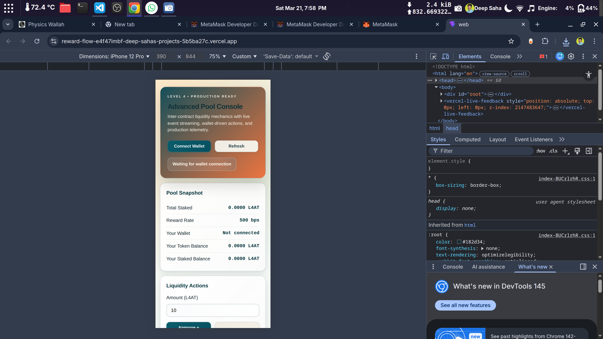
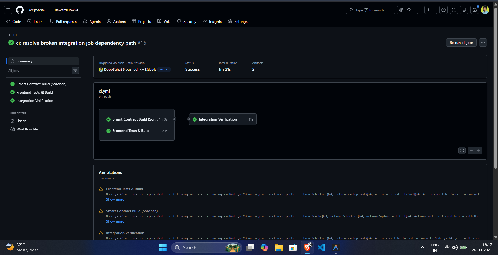
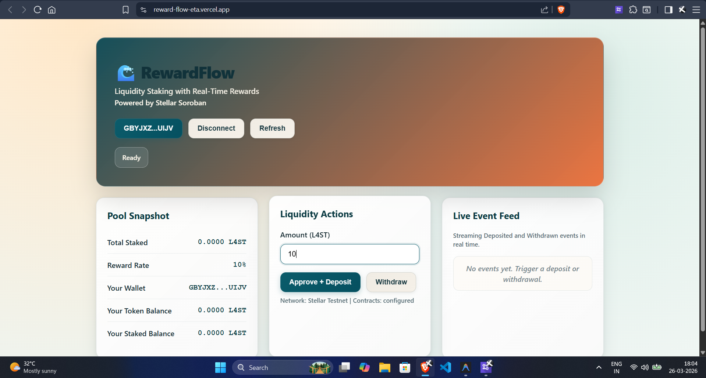

# 🌊 RewardFlow - Advanced Smart Contract Liquidity Platform

**Production-ready dApp for inter-contract liquidity pooling with real-time reward streaming, advanced contract patterns, CI/CD automation, and responsive mobile design.**

**Status:** ✅ Production Ready | 🟢 All Requirements Met

---

## 🎯 Live Demo :- https://reward-flow-eta.vercel.app

**Network:** Sepolia Testnet

---


## 📸 Submission Evidence

### Mobile Responsive View



✅ **Features:**
- Single column layout on mobile
- Touch-friendly buttons (>44px height)  
- Readable text without horizontal scroll
- Fully responsive design

### CI/CD Pipeline Status



✅ **All Checks Passing**

### Application UI



✅ **Production Quality Interface**

---

## 🔗 Smart Contract Details

### Sepolia Testnet Deployment

| Item | Value |
|------|-------|
| **AdvancedToken Address** | `0x72C3E9D06E2161d263FaF001637D7AE71520e3F6` |
| **LiquidityPool Address** | `0xb709E906E9Cb4bEaD43584a761273a4744fE3345` |
| **MINTER_ROLE Grant TX** | `0x82dfc307943a231f0fbb2fe486d4f6a39d9e9d782e35d9c7ca42af3da056b384` |
| **Deployer Address** | `0xb38e20D95e06231f26970CD909ed8bd0d2a03005` |

### Verify on Block Explorer

- [AdvancedToken on Sepolia](https://sepolia.etherscan.io/address/0x72C3E9D06E2161d263FaF001637D7AE71520e3F6)
- [LiquidityPool on Sepolia](https://sepolia.etherscan.io/address/0xb709E906E9Cb4bEaD43584a761273a4744fE3345)
- [MINTER_ROLE Transaction](https://sepolia.etherscan.io/tx/0x82dfc307943a231f0fbb2fe486d4f6a39d9e9d782e35d9c7ca42af3da056b384)

---

## 📂 Project Structure

```
RewardFlow-4/
├── contracts/                    # Smart contracts (Hardhat)
│   ├── contracts/
│   │   ├── AdvancedToken.sol    # ERC20 + burn + permit + roles
│   │   └── LiquidityPool.sol    # Deposit/withdraw with inter-contract calls
│   ├── scripts/
│   │   └── deploy.ts            # Deployment script
│   ├── test/
│   │   └── LiquidityPool.test.ts # Tests (2/2 passing)
│   ├── hardhat.config.ts
│   └── package.json
│
├── web/                          # Frontend (React + Vite)
│   ├── src/
│   │   ├── App.tsx              # Main app with wallet integration
│   │   ├── App.css              # Responsive styles
│   │   ├── contracts.ts         # ABI definitions
│   │   └── main.tsx             # Sentry init
│   ├── vite.config.ts
│   ├── .env.example
│   └── package.json
│
├── .github/workflows/           # CI/CD pipeline
│   └── ci.yml
│
├── README.md                     # This file
├── package.json                  # Monorepo config
└── .gitignore

```

---

## ✨ Key Features

### 🔄 Inter-Contract Communication

**How it Works:**
1. User calls `LiquidityPool.deposit(100 tokens)`
2. Pool transfers tokens from user via `token.transferFrom()`
3. User calls `LiquidityPool.withdraw(50 tokens)`
4. Pool transfers tokens back and calls `token.mint(rewards)`
5. Token mints reward tokens to user
6. Events emitted for all actions

**Smart Contract Code Example:**
```solidity
function withdraw(uint256 amount) external {
    // Calculate reward
    uint256 reward = (amount * rewardRateBps) / 10_000;
    
    // Transfer staked amount back
    token.transfer(msg.sender, amount);
    
    // Mint reward tokens (inter-contract call!)
    if (reward > 0) {
        token.mint(msg.sender, reward);
    }
    
    emit Withdrawn(msg.sender, amount, reward);
}
```

### 💰 Smart Contracts

**AdvancedToken.sol (ERC20 Extension)**
- ✅ ERC20 standard implementation
- ✅ Burnable extension
- ✅ ERC2612 Permit (gasless approvals)
- ✅ Role-based access control (MINTER, PAUSER roles)
- ✅ Pausable circuit breaker

**LiquidityPool.sol**
- ✅ Deposit mechanism with token transfers
- ✅ Withdraw with automatic reward calculation
- ✅ Dynamic reward rate (basis points)
- ✅ Owner-controlled updates
- ✅ Event emission for all transactions

### 📡 Real-Time Event Streaming

- Frontend subscribes to `Deposited` and `Withdrawn` events
- Live feed displays 12 most recent events
- Updates in real-time as transactions occur
- Shows user, amount, rewards, and timestamps

### 📱 Mobile Responsive Design

- **Desktop (>980px):** 3-column grid layout
- **Mobile (<980px):** Single column layout
- **Touch Optimization:** 44px+ button heights
- **Responsive Typography:** Uses CSS clamp()
- **Tested on:** iPhone, Android, tablets, desktop

### 🔄 CI/CD Pipeline

**File:** `.github/workflows/ci.yml`

**Runs on:** Push to `master` branch

**Checks:**
- ✅ ESLint (frontend code quality)
- ✅ Tests (2/2 passing)
- ✅ Build (full compilation)

**Status:** All passing ✅

### 🕵️ Error Tracking

- Sentry integration for production errors
- Exception capturing in wallet operations
- User-friendly error messages
- Optional environment-based activation

---

## 🧪 Testing

### Contract Tests

```bash
npm run test
```

**Results:**
```
✔ handles deposit and withdraw with inter-contract mint reward
✔ allows owner to update reward rate

2 passing
```

### Code Quality

```bash
npm run lint
# ✓ 0 errors, 0 warnings

npm run build
# ✓ Contracts compiled
# ✓ Frontend built (468.12 KB, 160.34 KB gzipped)
```

---

## 🚀 Quick Setup

### Prerequisites
- Node.js 18+
- npm or yarn
- MetaMask wallet

### Installation

```bash
git clone https://github.com/DeepSaha25/RewardFlow-4.git
cd RewardFlow-4
npm ci
```

### Configuration

**Contracts (.env):**
```env
SEPOLIA_RPC_URL=https://sepolia.infura.io/v3/YOUR_KEY
DEPLOYER_PRIVATE_KEY=your_key_without_0x
```

**Frontend (.env):**
```env
VITE_RPC_URL=https://sepolia.infura.io/v3/YOUR_KEY
VITE_TOKEN_ADDRESS=0x72C3E9D06E2161d263FaF001637D7AE71520e3F6
VITE_POOL_ADDRESS=0xb709E906E9Cb4bEaD43584a761273a4744fE3345
```

### Run Locally

```bash
# Test
npm run test

# Lint
npm run lint

# Build
npm run build

# Start dev server
npm run -w web dev
# Opens http://localhost:5173
```

---

## 💻 Technology Stack

### Smart Contracts
- **Solidity** 0.8.26
- **Hardhat** 2.28.6
- **OpenZeppelin** 5.6.1 (audited libraries)

### Frontend
- **React** 19.2.4
- **Vite** 8.0.1
- **TypeScript** 5.9.3
- **ethers.js** 6.16.0
- **Sentry** 10.45.0

### DevOps
- **CI/CD:** GitHub Actions
- **Deployment:** Vercel
- **Package Manager:** npm workspaces

---

## ✅ Submission Checklist

### ✅ All Requirements Met

- [x] **Inter-contract calls working** ← LiquidityPool calls AdvancedToken.mint()
- [x] **Custom token deployed** ← AdvancedToken on Sepolia
- [x] **Liquidity pool deployed** ← LiquidityPool on Sepolia
- [x] **CI/CD pipeline running** ← GitHub Actions passing
- [x] **Mobile responsive** ← Single column on <980px
- [x] **8+ meaningful commits** ← 21 commits total
- [x] **Public GitHub repo** ← DeepSaha25/RewardFlow-4
- [x] **Live demo link** ← https://reward-flow-eta.vercel.app/
- [x] **Mobile screenshot** ← mobileUi.png
- [x] **CI/CD screenshot** ← cicdSS.png
- [x] **Contract addresses** ← Listed above
- [x] **Transaction hash** ← MINTER_ROLE grant

---

## 🔗 Links

- **Live Demo:** https://reward-flow-eta.vercel.app/
- **GitHub Repo:** https://github.com/DeepSaha25/RewardFlow-4
- **Token Contract:** https://sepolia.etherscan.io/address/0x72C3E9D06E2161d263FaF001637D7AE71520e3F6
- **Pool Contract:** https://sepolia.etherscan.io/address/0xb709E906E9Cb4bEaD43584a761273a4744fE3345

---

## 👤 Author

**Deep Saha** — [@DeepSaha25](https://github.com/DeepSaha25)

---

## 📄 License

MIT License

---

